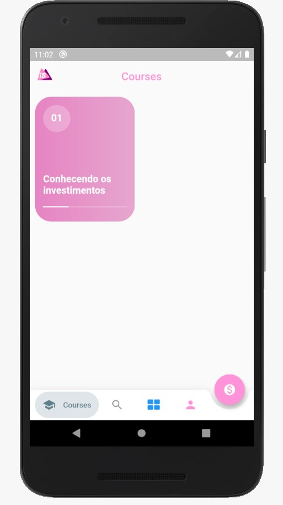
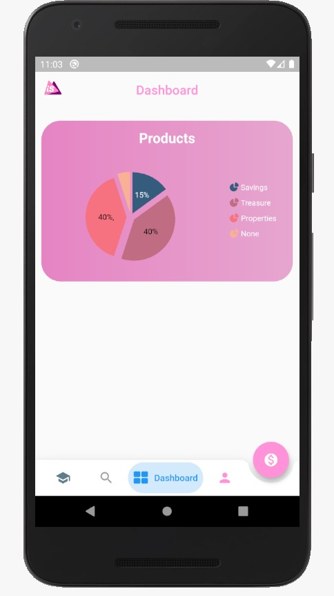
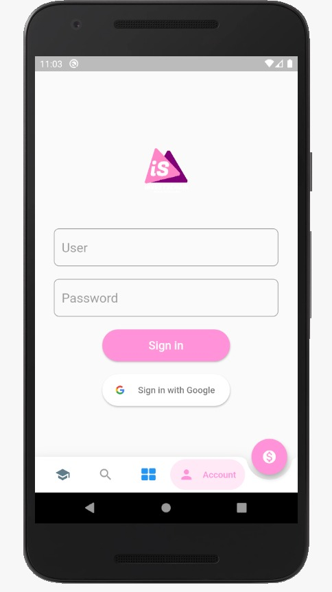

<h1 align="center">
  
 
InvestSchool
</h1>

This project is the MVP of MegaHack promoted by Shawee.

     

## Features
This app features all the latest tools and practices in mobile development!

- **Modular** — A smart project structure.
- **Slidy** — CLI package manager and template for Flutter
